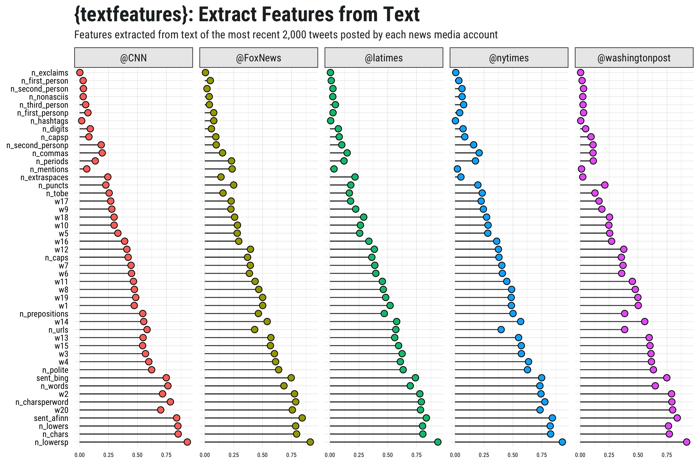

textfeatures 
===========================================================================

[](https://travis-ci.org/mkearney/textfeatures) [](https://cran.r-project.org/package=textfeatures)

[](https://www.tidyverse.org/lifecycle/#experimental)

A simple package for extracting useful features from character objects.

Install
-------

Install from CRAN.

``` r
## download from CRAN
install.packages("textfeatures")
```

Or install the development version from Github.

``` r
## download devtools if necessary
if (!requireNamespace("devtools", quietly = TRUE)) {
  install.packages("devtools")
}

## install from github
devtools::install_github("mkearney/textfeatures")
```

Usage
-----

### Input: `character`

``` r
## vector of some text
x <- c(
  "this is A!\t sEntence https://github.com about #rstats @github",
  "doh", "THe following list:\n- one\n- two\n- three\nOkay!?!"
)

## get text features
textfeatures(x)
#> # A tibble: 3 x 17
#>   n_chars n_commas n_digits n_exclaims n_extraspaces n_hashtags n_lowers
#>     <int>    <int>    <int>      <int>         <int>      <int>    <int>
#> 1      21        0        0          1             3          1       18
#> 2       3        0        0          0             0          0        3
#> 3      38        0        0          2             4          0       28
#> # ... with 10 more variables: n_lowersp <dbl>, n_mentions <int>,
#> #   n_periods <int>, n_urls <int>, n_words <int>, n_caps <int>,
#> #   n_nonasciis <int>, n_puncts <int>, n_capsp <dbl>, n_charsperword <dbl>
```

### Input: `data.frame`

``` r
## data frame with up to one hundred tweets
rt <- rtweet::search_tweets("rstats", n = 100, verbose = FALSE)

## get text features
textfeatures(rt)
#> # A tibble: 100 x 17
#>    n_chars n_commas n_digits n_exclaims n_extraspaces n_hashtags n_lowers
#>      <int>    <int>    <int>      <int>         <int>      <int>    <int>
#>  1     216        2        0          1             3          1      199
#>  2      54        0        0          0             3          1       46
#>  3      79        0        0          0             4          2       68
#>  4      43        0        0          0             2          2       34
#>  5     149        0        0          0             2          2      140
#>  6      63        1        2          0             3          2       40
#>  7     105        1        0          0             2          0       90
#>  8     105        1        0          0             2          0       90
#>  9     105        1        0          0             2          0       90
#> 10     105        1        0          0             2          1       96
#> # ... with 90 more rows, and 10 more variables: n_lowersp <dbl>,
#> #   n_mentions <int>, n_periods <int>, n_urls <int>, n_words <int>,
#> #   n_caps <int>, n_nonasciis <int>, n_puncts <int>, n_capsp <dbl>,
#> #   n_charsperword <dbl>
```

### Input: `grouped_df`

``` r
## data frame with up to two hundred tweets for each of 5 users
gdf <- rtweet::get_timelines(
  c("wapo", "cnn", "nytimes", "foxnews", "latimes"), n = 1000)

## group by screen_name and return text features
f <- textfeatures(dplyr::group_by(gdf, screen_name))

## load ggplot
suppressPackageStartupMessages(library(tidyverse))

## standardize function
scale_standard <- function(x) (x - 0) / (max(x, na.rm = TRUE) - 0)

## convert to long (tidy) form and plot
p <- f %>%
  mutate_if(is.numeric, scale_standard) %>%
  gather(var, val, -screen_name) %>%
  ggplot(aes(x = var, y = val, fill = screen_name)) + 
  geom_col(width = .65) + 
  theme_bw(base_family = "Roboto Condensed") + 
  facet_wrap( ~ screen_name, nrow = 1) + 
  coord_flip() + 
  theme(legend.position = "none",
    axis.text = element_text(colour = "black"),
    plot.title = element_text(face = "bold")) + 
  labs(y = NULL, x = NULL,
    title = "{textfeatures}: Extract Features from Text",
    subtitle = "Features extracted from text of the most recent 1,000 tweets posted by each news media account")

## save plot
ggsave("tools/readme/readme.png", p, width = 7, height = 7, units = "in")
```


